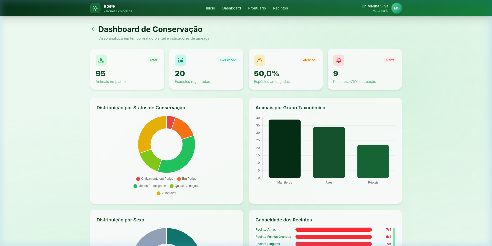
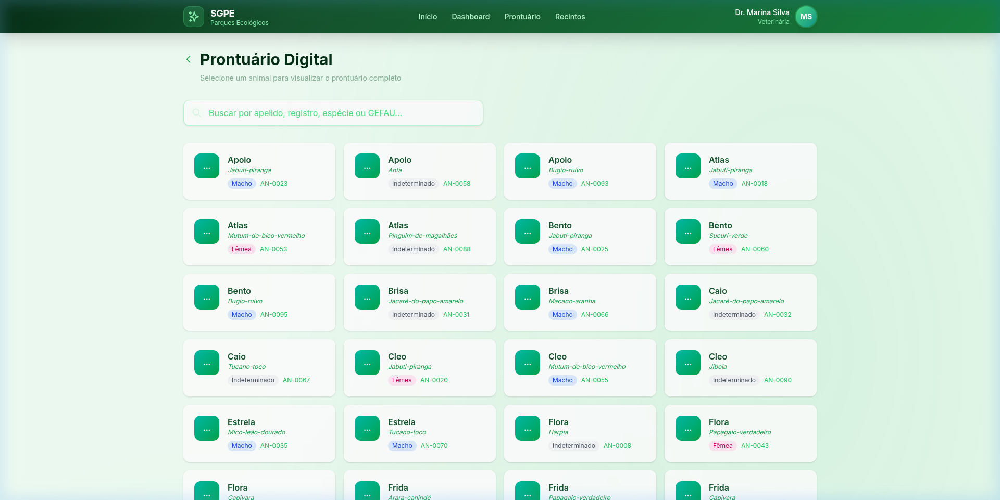
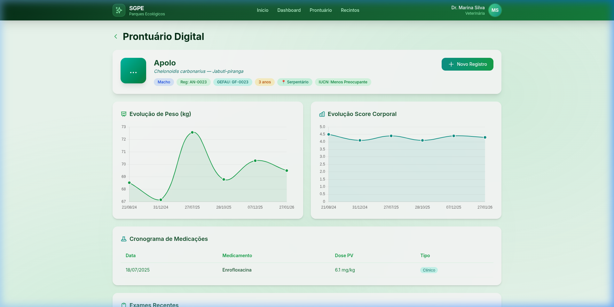
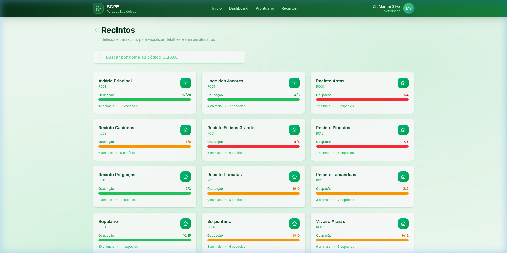
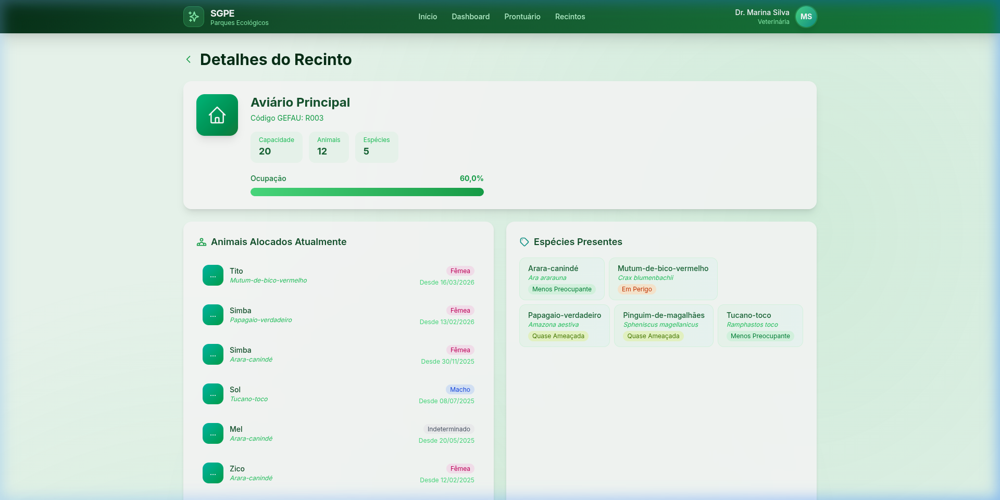

<p align="center">
  
  
  
  
  
</p>

# 🌿 SGPE — Sistema de Gestão para Parques Ecológicos

O **SGPE** é um sistema web de código aberto para gestão de fauna em parques ecológicos e instituições de conservação. A plataforma centraliza informações sobre animais, espécies, recintos, prontuários veterinários e indicadores de conservação — substituindo planilhas dispersas por uma interface integrada, ágil e rastreável.

---

## 📋 Contexto e Motivação

O [Parque Ecológico Dr. Antônio Teixeira Vianna](https://www.saocarlos.sp.gov.br), localizado em São Carlos — SP, é referência nacional em manejo e conservação da biodiversidade brasileira. Com mais de **70 hectares**, abriga cerca de **500 animais** distribuídos em aproximadamente **100 recintos**, representando mais de **90 espécies** (65% ameaçadas de extinção).

Atualmente o parque gerencia seus dados de forma descentralizada, em planilhas individuais no Google Drive. Isso dificulta:

- Consultas cruzadas entre animais, espécies e recintos
- Controle histórico individual de cada animal
- Acompanhamento de tratamentos veterinários
- Geração de relatórios gerenciais

O SGPE nasce para resolver esses problemas, oferecendo mecanismos de **busca, filtragem, visualização analítica e registro estruturado**, garantindo **confiabilidade, rastreabilidade e eficiência** na gestão das informações.

> **💡 Originalidade:** Sistemas dedicados ao manejo de fauna em parques ecológicos são escassos. Soluções genéricas de mercado não aderem à realidade dessas instituições. O SGPE é concebido de forma **generalista e modular**, podendo ser adotado por qualquer parque ou instituição de conservação.

---

## ✨ Funcionalidades Implementadas

### 1. 📊 Dashboard de Conservação

Painel analítico em tempo real com indicadores de conservação do plantel.

| Componente | Descrição |
|---|---|
| **KPIs** | Total de animais, espécies registradas, % ameaçadas (IUCN), recintos em alerta |
| **Gráfico Donut — Status IUCN** | Distribuição das espécies por status de conservação (LC, NT, VU, EN, CR) |
| **Gráfico de Barras — Taxonomia** | Animais agrupados por grupo taxonômico (Mamíferos, Aves, Répteis) |
| **Gráfico Donut — Sexo** | Distribuição por sexo (Macho, Fêmea, Indeterminado) |
| **Capacidade dos Recintos** | Barras de progresso coloridas (verde/amarelo/vermelho) |
| **Últimas Alocações** | Tabela com as entradas mais recentes |



---

### 2. 🩺 Prontuário Digital e Linha do Tempo Veterinária

Histórico médico completo por animal com interface de busca, gráficos de evolução e formulários de registro.

**Seleção de Animal** — Busca por apelido, número de registro, espécie ou código GEFAU:



**Dashboard do Animal** — Ficha completa com:

| Componente | Descrição |
|---|---|
| **Ficha do Animal** | Apelido, espécie, sexo, idade, recinto atual, nº GEFAU, status IUCN |
| **Alertas Ativos** | Restrições e riscos registrados para o animal |
| **Evolução de Peso** | Gráfico de linha temporal com dados de triagens |
| **Evolução Score Corporal** | Gráfico de linha temporal (escala 0–5) |
| **Cronograma de Medicações** | Tabela com medicações administradas, doses e datas |
| **Exames Recentes** | Cards com tipo, data e resultado dos exames |
| **Histórico de Registros** | Timeline vertical com registros clínicos e biológicos |



**Formulário de Novo Registro** — Permite adicionar registros clínicos/biológicos com:
- Campos dinâmicos para múltiplas medicações (medicamento + dose PV)
- Campos dinâmicos para múltiplos exames (tipo + data + resultado)
- Upload de laudo de saúde (anexo)
- Seleção de funcionário responsável

---

### 3. 🏠 Recintos

Visualização e gestão dos recintos do parque com indicadores de ocupação.

**Seleção de Recinto** — Grid com barras de ocupação e busca por nome/código:



**Detalhes do Recinto** — Dashboard individual com:

| Componente | Descrição |
|---|---|
| **Ficha do Recinto** | Nome, código GEFAU, capacidade máxima, ocupação atual |
| **Indicador de Ocupação** | Barra de progresso com alertas visuais |
| **Animais Alocados** | Lista de animais atualmente no recinto (clicáveis para o prontuário) |
| **Espécies Presentes** | Badges com nome científico e status de conservação |
| **Histórico de Alocações** | Tabela com entradas e saídas ao longo do tempo |



---

## 🗂️ Estrutura do Projeto

```
SGPE/
├── manage.py                   # Utilitário de gerenciamento Django
├── sgpe/                       # Configuração do projeto Django
│   ├── settings.py             # Configurações (DB, apps, i18n, static)
│   ├── urls.py                 # Rotas raiz
│   └── wsgi.py
├── core/                       # App principal
│   ├── models.py               # 17 modelos (Espécie, Animal, Recinto, etc.)
│   ├── views.py                # Views (home, dashboard, prontuário, recintos)
│   ├── urls.py                 # Rotas da aplicação
│   ├── forms.py                # Formulários Django
│   ├── admin.py                # Configuração do Django Admin
│   └── management/
│       └── commands/
│           └── seed_data.py    # Script de dados de demonstração
├── templates/                  # Templates HTML (Django + Tailwind)
│   ├── base.html               # Layout base (navbar, footer, estilos)
│   ├── home.html               # Tela inicial
│   ├── dashboard.html          # Dashboard de Conservação
│   ├── prontuario/
│   │   ├── selecao.html        # Seleção de animal
│   │   ├── detalhes.html       # Dashboard do animal
│   │   └── registro_form.html  # Formulário de novo registro
│   └── recintos/
│       ├── selecao.html        # Seleção de recinto
│       └── detalhes.html       # Detalhes do recinto
├── static/                     # Arquivos estáticos (CSS, JS, imagens)
└── docs/
    └── screenshots/            # Capturas de tela para documentação
```

---

## 🧬 Modelo de Dados

O sistema implementa **17 entidades** baseadas no modelo conceitual e relacional do banco de dados, incluindo:

| Entidade | Descrição |
|---|---|
| `Especie` | Classificação taxonômica, plano de manejo e status de conservação IUCN |
| `Animal` | Indivíduo com registro, marcações, apelido, sexo e vínculo à espécie |
| `Recinto` | Local de alocação com capacidade máxima e contagem de ocupação |
| `Alocacao` | Histórico de movimentação de animais entre recintos |
| `Triagem` | Registros de peso, score corporal e gravidade veterinária |
| `Registro` | Ocorrências clínicas e biológicas com detalhamento e tratamento |
| `MedicacaoAdministrada` | Medicamentos e doses vinculados a registros |
| `Exame` | Exames realizados com tipo, resultado e observações |
| `Funcionario` | Equipe do parque (veterinários, tratadores, biólogos) |
| `Restricao` / `Risco` | Alertas ativos por animal |
| `Documento`, `Prole`, `Casal`, `ItemCardapio`, `DescricaoRotina`, `RegistroRotina` | Entidades complementares (modeladas, sem tela dedicada nesta versão) |

---

## 🚀 Como Rodar

### Pré-requisitos

- **Python 3.12+**
- **pip** (gerenciador de pacotes Python)
- Conexão com internet (para carregar Tailwind CSS e Chart.js via CDN)

### 1. Clonar o repositório

```bash
git clone https://github.com/seu-usuario/SGPE.git
cd SGPE
```

### 2. Criar ambiente virtual (recomendado)

```bash
python3 -m venv venv
source venv/bin/activate   # Linux/macOS
# ou: venv\Scripts\activate  # Windows
```

### 3. Instalar dependências

```bash
pip install Django psycopg2-binary django-widget-tweaks Pillow
```

### 4. Aplicar migrações (criar banco de dados)

> Por padrão, o sistema usa **SQLite** para facilitar o desenvolvimento. Para usar PostgreSQL, veja a seção abaixo.

```bash
python3 manage.py migrate
```

### 5. Popular com dados de demonstração

```bash
python3 manage.py seed_data
```

Isso criará automaticamente:
- 20 espécies com status IUCN
- 95 animais distribuídos em 14 recintos
- 4 funcionários
- 362 triagens (peso e score corporal)
- 110 registros clínicos com medicações e exames
- Restrições e riscos para demonstração de alertas

### 6. Iniciar o servidor

```bash
python3 manage.py runserver
```

Acesse: **http://127.0.0.1:8000/**

---

## 🐘 Configuração com PostgreSQL (Opcional)

Para usar PostgreSQL em vez de SQLite:

1. Crie o banco de dados:
```sql
CREATE DATABASE sgpe_db;
CREATE USER sgpe_user WITH PASSWORD 'sgpe_pass123';
ALTER ROLE sgpe_user SET client_encoding TO 'utf8';
ALTER ROLE sgpe_user SET default_transaction_isolation TO 'read committed';
ALTER ROLE sgpe_user SET timezone TO 'America/Sao_Paulo';
GRANT ALL PRIVILEGES ON DATABASE sgpe_db TO sgpe_user;
ALTER DATABASE sgpe_db OWNER TO sgpe_user;
```

2. Em `sgpe/settings.py`, comente o bloco SQLite e descomente o bloco PostgreSQL:

```python
DATABASES = {
    'default': {
        'ENGINE': 'django.db.backends.postgresql',
        'NAME': 'sgpe_db',
        'USER': 'sgpe_user',
        'PASSWORD': 'sgpe_pass123',
        'HOST': 'localhost',
        'PORT': '5432',
    }
}
```

3. Execute as migrações e o seed novamente:
```bash
python3 manage.py migrate
python3 manage.py seed_data
```

---

## 🛠️ Stack Tecnológica

| Camada | Tecnologia |
|---|---|
| **Backend** | Django 6.0 (Python) |
| **Banco de Dados** | SQLite (dev) / PostgreSQL (produção) |
| **Frontend** | HTML5 + JavaScript |
| **Estilização** | Tailwind CSS 4 (via CDN) |
| **Gráficos** | Chart.js 4 |
| **Tipografia** | Inter (Google Fonts) |
| **Formulários** | django-widget-tweaks |

---

## 📝 Próximos Passos

- [ ] Sistema de autenticação com Django Auth (login, registro, permissões)
- [ ] Gerenciamento de conta do usuário (perfil, foto, configurações)
- [ ] CRUD completo de espécies, animais e recintos
- [ ] Relatórios gerenciais em PDF
- [ ] Upload e visualização de fotos dos animais
- [ ] Módulo de cardápio e rotinas (enriquecimento, condicionamento)
- [ ] Módulo de documentos (baixas, entradas, transferências)
- [ ] Deploy para produção (Docker + Nginx + Gunicorn)
- [ ] Testes automatizados

---

## 🤝 Contribuições

Este é um projeto de código aberto voltado para a comunidade de conservação. Contribuições são bem-vindas! Sinta-se à vontade para abrir issues, enviar pull requests ou sugerir melhorias.

---

## 📄 Licença

Este projeto está licenciado sob a [Licença MIT](LICENSE).

---

<p align="center">
  <strong>SGPE</strong> — Feito com 💚 para a conservação da biodiversidade brasileira
</p>
