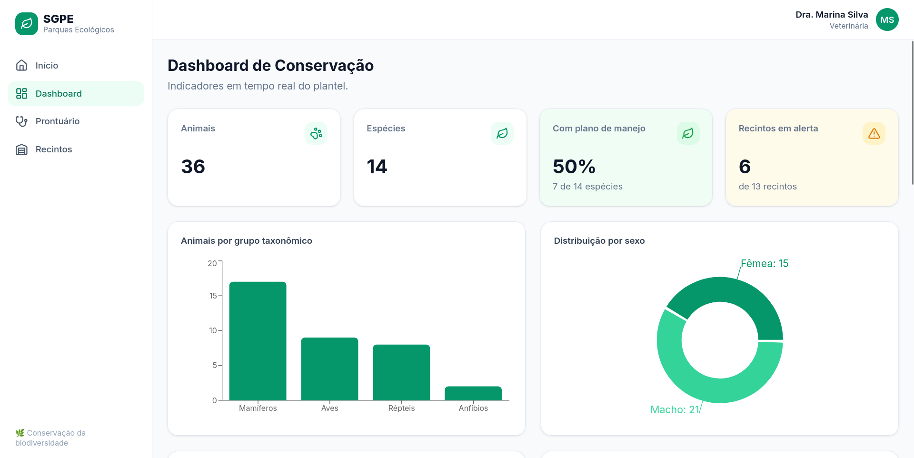
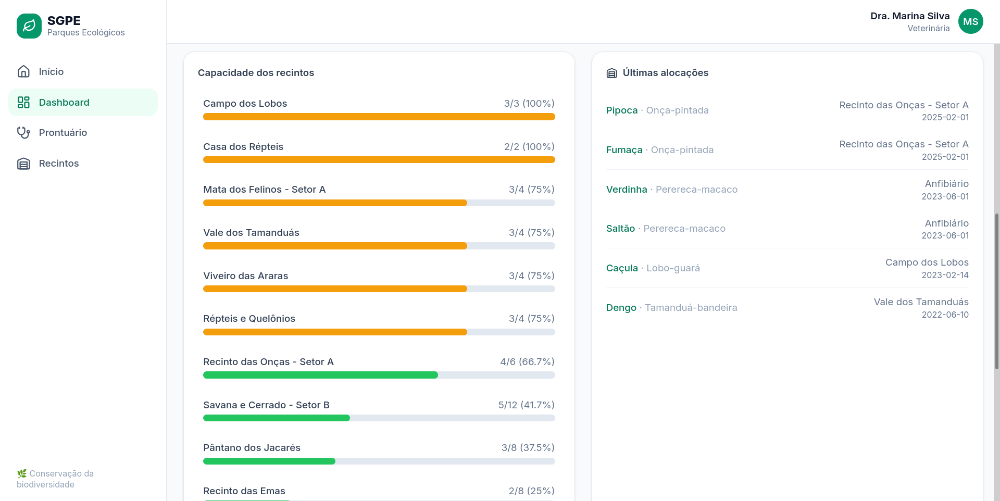
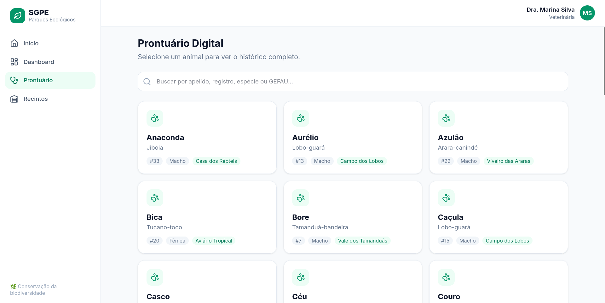
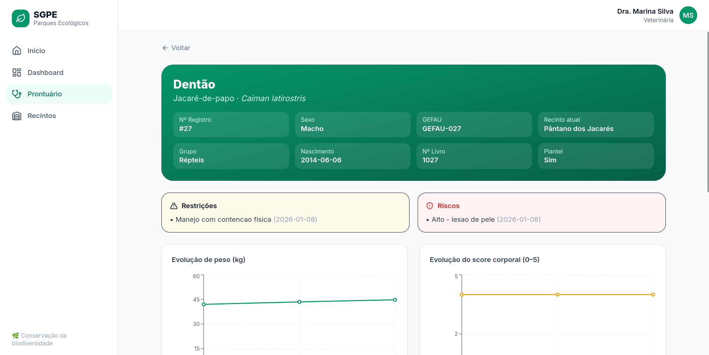
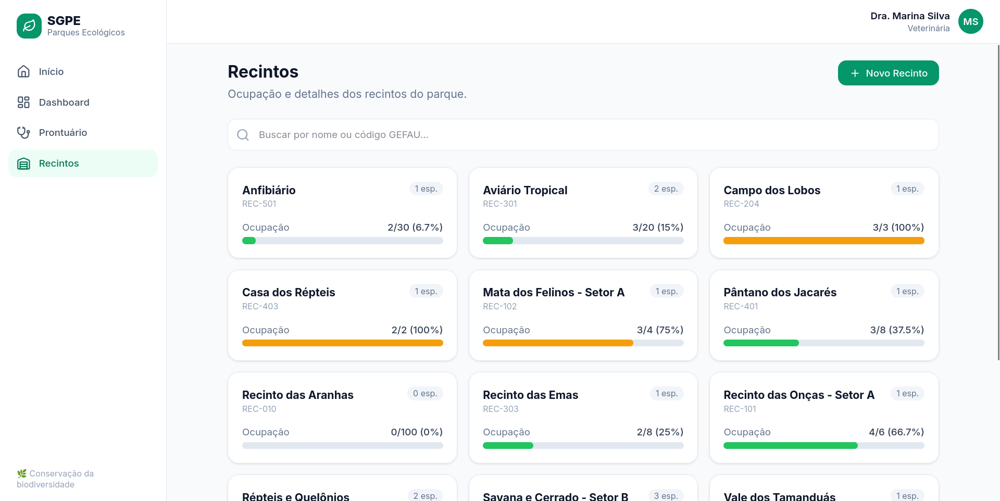
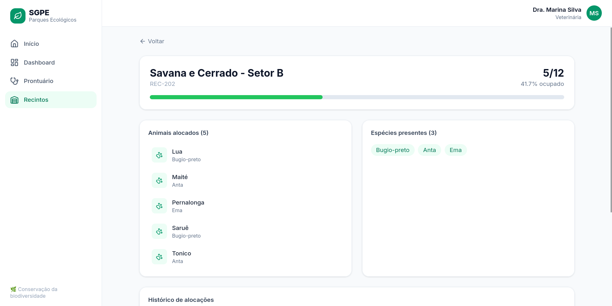

<p align="center">
  
  
  
  
  
  
</p>

# 🌿 SGPE — Sistema de Gestão para Parques Ecológicos

O **SGPE** é um sistema web de código aberto para gestão de fauna em parques ecológicos e instituições de conservação. A plataforma centraliza informações sobre animais, espécies, recintos e prontuários veterinários — substituindo planilhas dispersas por uma interface integrada, ágil e rastreável.

---

## 📋 Contexto e Motivação

O [Parque Ecológico Dr. Antônio Teixeira Vianna](https://www.saocarlos.sp.gov.br), em São Carlos — SP, é referência nacional em manejo e conservação da biodiversidade brasileira. Com mais de **70 hectares**, abriga cerca de **500 animais** distribuídos em aproximadamente **100 recintos**, representando mais de **90 espécies** (65% ameaçadas de extinção).

Atualmente o parque gerencia seus dados de forma descentralizada, em planilhas individuais no Google Drive. Isso dificulta:

- Consultas cruzadas entre animais, espécies e recintos
- Controle histórico individual de cada animal
- Acompanhamento de tratamentos veterinários
- Geração de relatórios gerenciais

O SGPE nasce para resolver esses problemas, oferecendo **busca, filtragem, visualização analítica e registro estruturado**, garantindo **confiabilidade, rastreabilidade e eficiência** na gestão das informações.

> **💡 Originalidade:** Sistemas dedicados ao manejo de fauna em parques ecológicos são escassos. Soluções genéricas de mercado não aderem à realidade dessas instituições. O SGPE é concebido de forma **generalista e modular**, podendo ser adotado por qualquer parque ou instituição de conservação.

---

## 🏗️ Arquitetura

O SGPE é um **monólito modular** dividido em três serviços orquestrados via Docker Compose:

```
┌─────────────┐      ┌──────────────┐      ┌──────────────┐
│  Frontend   │ ───► │   Backend    │ ───► │  PostgreSQL  │
│ React + Vite│ HTTP │   FastAPI    │ SQL  │              │
│ Tailwind v4 │      │ (somente     │      │ esquema via  │
│             │      │  leitura)    │      │ init-scripts │
└─────────────┘      └──────────────┘      └──────────────┘
   :5173                 :8000                  :5432
```

**Decisões de projeto importantes:**

- **O esquema do banco é o núcleo do projeto** e vive em [`init-scripts/`](init-scripts/) como SQL puro. O container PostgreSQL executa esses scripts automaticamente na primeira inicialização (`/docker-entrypoint-initdb.d`): primeiro `01-esquema.sql` (DDL), depois `02-dados.sql` (dados de demonstração).
- **Sem migrations.** O backend **não cria nem altera** tabelas. Os modelos SQLAlchemy apenas **espelham** o esquema existente para que a API possa **consultá-lo** (somente leitura).
- O backend é organizado por **módulos de domínio** (`especies/`, `animais/`, `recintos/`, `dashboard/`), cada um com `router.py`, `services.py`, `models.py` e `schemas.py`.
- Esta versão **não possui autenticação** (mantém um usuário fictício na interface, como o protótipo original).

### Estrutura de pastas

```
SGPE/
├── docker-compose.yml          # orquestra postgres + backend + frontend
├── .env.example                # variáveis de ambiente
├── init-scripts/               # ESQUEMA + DADOS (executados pelo Postgres)
│   ├── 01-esquema.sql          # DDL traduzido para PostgreSQL
│   └── 02-dados.sql            # dados de demonstração
├── sql/                        # scripts Oracle originais (referência histórica)
├── backend/                    # API FastAPI (Python, SQLAlchemy async — leitura)
│   └── app/
│       ├── core/               # config + conexão com o banco
│       ├── especies/ animais/ recintos/ dashboard/   # módulos de domínio
│       └── shared/             # modelos de tabelas sem endpoint dedicado
└── frontend/                   # SPA React + Vite + Tailwind v4
    └── src/{pages,components,contexts,lib,types}
```

---

## ✨ Funcionalidades

### 📊 Dashboard de Conservação
KPIs do plantel (animais, espécies, % com plano de manejo, recintos em alerta), distribuição por **grupo taxonômico** e por **sexo**, barras de **ocupação dos recintos** e **últimas alocações**.




### 🩺 Prontuário Digital
Busca de animais e ficha individual completa: dados do animal, **alertas** (restrições e riscos), **gráficos de evolução** de peso e score corporal, **medicações**, **exames** e uma **linha do tempo** unindo registros clínicos e biológicos.




### 🏠 Recintos
Grade de recintos com indicadores de ocupação, e página de detalhe com animais alocados, espécies presentes e histórico de movimentações.




---

## 🚀 Como rodar

### Pré-requisitos
- **Docker** e **Docker Compose** (v2+). É só isso — Python, Node e PostgreSQL rodam dentro dos containers.

### Passos

```bash
# 1. Clonar o repositório
git clone https://github.com/Nickson8/SGPE.git
cd SGPE

# 2. Criar o arquivo de ambiente a partir do exemplo
cp .env.example .env

# 3. Subir tudo (build apenas na primeira vez)
docker compose up --build
```

Na **primeira** subida, o PostgreSQL cria o esquema e carrega os dados de demonstração automaticamente a partir de `init-scripts/`. Pronto:

| Serviço | URL |
|---|---|
| **Frontend** | http://localhost:5173 |
| **API (Swagger)** | http://localhost:8000/docs |
| **Health check** | http://localhost:8000/api/health |
| **PostgreSQL** | `localhost:5433` (usuário/senha/db: `sgpe` / `sgpe` / `sgpe_db`) |

### Recriar o banco do zero
Os `init-scripts/` só rodam quando o volume de dados está **vazio**. Para reexecutá-los (reaplicando esquema + dados), remova o volume:

```bash
docker compose down -v   # apaga o volume do Postgres
docker compose up        # recria e repopula
```

Para parar mantendo os dados: `docker compose down`.

---

## 🛠️ Stack Tecnológica

| Camada | Tecnologia |
|---|---|
| **Frontend** | React 18 + TypeScript + Vite |
| **Estilização** | Tailwind CSS 4 |
| **Gráficos** | Recharts |
| **Backend** | FastAPI (Python 3.12) |
| **ORM (leitura)** | SQLAlchemy 2 (async) + asyncpg |
| **Banco de Dados** | PostgreSQL 16 |
| **Orquestração** | Docker Compose |

---

## 📄 Licença

Este projeto está licenciado sob a [Licença MIT](LICENSE).

---

<p align="center">
  <strong>SGPE</strong> — Feito com 💚 para a conservação da biodiversidade brasileira
</p>
